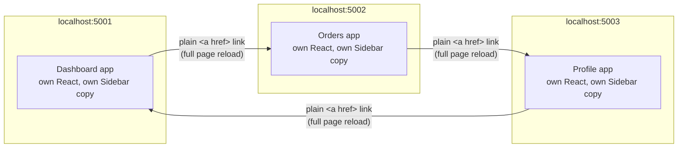
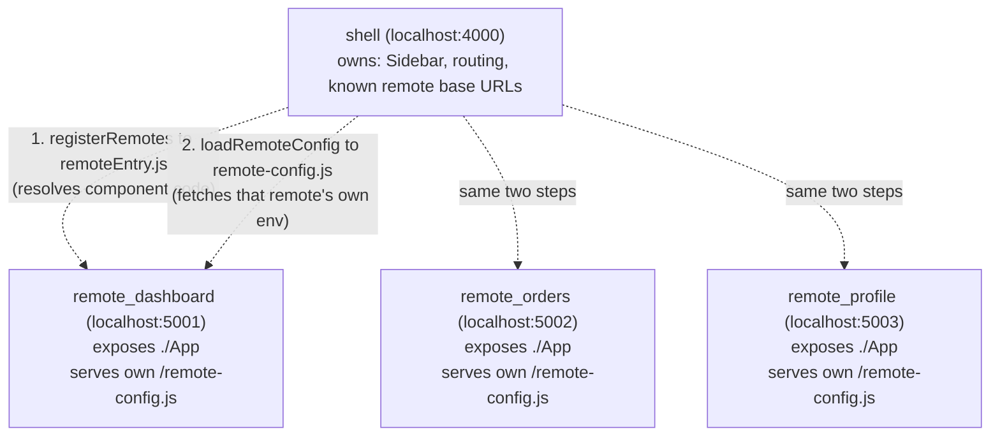
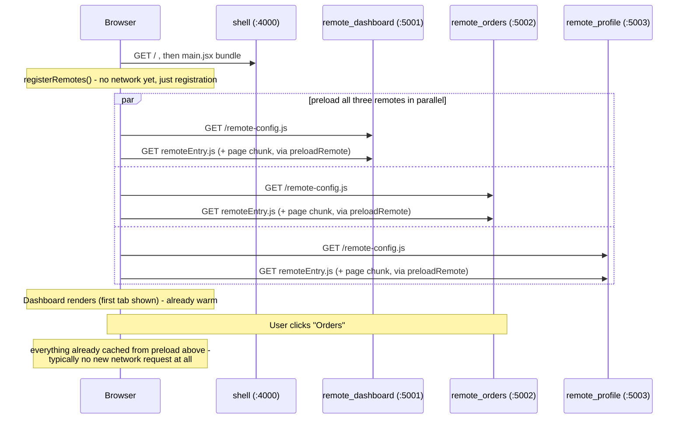

# Module Federation 2.0 for Vite — How It Actually Works

A small, runnable proof of concept for understanding what happens under the hood
when several independently-built React apps are combined into one SPA using
**Module Federation 2.0** (`@module-federation/vite`, from the
[module-federation.io](https://module-federation.io) project). It's built around
a common real-world scenario: a "portal" made of a Dashboard, Orders, and Profile
section, each historically built and deployed as its own app.

Two runnable projects are included:

- **`baseline/`** — three fully independent Vite/React apps (`dashboard`,
  `orders`, `profile`), each with its own copy of the left nav. This is the
  starting point many teams are in: no reverse proxy, no shared runtime, an
  identical sidebar hand-copied into every app to make them *look* like one
  product.
- **`federated/`** — the same three pages, rebuilt with Module Federation. One
  `shell` app owns the nav and routing; the three former apps become
  **remotes** that expose only their page content.

Everything described below was verified by actually building and running both
projects, not just described from documentation — see "How to run this
yourself" near the end.

### Key facts up front, to avoid re-litigating them

- **No `mf-manifest.json` anywhere in this setup.** MF 2.0 supports an
  optional manifest file, but this POC (matching a real setup it's modeled
  on) resolves every remote directly from `remoteEntry.js`. If you've read
  about the manifest elsewhere, ignore it for the purposes of this repo — §3
  covers why it's mentioned at all.
- **`remote-config.js` is per-remote, not per-shell.** Each remote serves its
  *own* `/remote-config.js`, describing its *own* runtime environment (e.g.
  which backend API it should call). The shell does not have one of its own,
  and does not assemble one on remotes' behalf. §7 covers this in full.
- **Two separate, independent mechanisms are at play**, easy to conflate
  because they both involve a base URL and both run at app startup:
  1. **Module Federation's own resolution** — `registerRemotes()` /
     `loadRemote()`, pointed at each remote's `remoteEntry.js`. This is what
     actually fetches and runs a remote's exposed component code.
  2. **Per-remote runtime config injection** — `loadRemoteConfig()` fetching
     a remote's `/remote-config.js`. This has nothing to do with fetching
     component code; it just gives an already-located remote access to its
     own environment variables once it's about to run.

---

## 1. The baseline: three apps wearing the same outfit



Because there's no reverse proxy unifying them under one origin, "one SPA" here
really means "three separate sites styled to look the same." Clicking a nav
link is a full browser navigation — new document, new JS download, new React
mount. The identical sidebar isn't shared code; it's the same text pasted into
three places, which is the usual reason a team looks for a real mechanism
instead of relying on copy-paste discipline to keep three UIs in sync.

Building one of these apps and inspecting `dist/` shows why there's nothing to
inspect yet:

```
dist/index.html
dist/assets/index-<hash>.js   ← everything: React, ReactDOM, Sidebar, page — one bundle
```

No `remoteEntry.js`, no config of any kind. Nothing here is remotely
loadable — it's a closed, self-contained bundle. This is the reference point
for everything that follows.

---

## 2. The federated architecture



The key shift: the shell's source code **never imports** `remote_dashboard/App`
from a real file on disk — that module doesn't exist in the shell's repository
at all. It's resolved *at runtime, in the browser*, against whatever the
remote happens to be serving at that moment. That's the entire premise of
Module Federation, and it's why the browser's network tab suddenly shows files
the shell's own source code never mentions.

Note the second, separate arrow per remote in the diagram — that's the part
that's easy to miss (see the "Key facts" box above and §7).

---

## 3. What each file in the network tab actually is

Here's what's really happening with each artifact, confirmed against a real
build of this POC.

### `remoteEntry.js` — generated by the MF Vite plugin, at build time, from `exposes`

Each remote's Module Federation config is passed straight into the `federation()`
plugin inside `vite.config.js` — there's no separate config file. (A standalone
`module-federation.config.js` exported via `createModuleFederationConfig()` is
just as valid and behaves identically; some setups split it out for reuse
across tooling, others inline it. Same object either way.)

```js
// remote-dashboard/vite.config.js
import { defineConfig } from 'vite';
import react from '@vitejs/plugin-react';
import { federation } from '@module-federation/vite';

export default defineConfig({
  plugins: [
    react(),
    federation({
      name: 'remote_dashboard',
      filename: 'remoteEntry.js',
      exposes: { './App': './src/App.jsx' },
      shared: {
        react: { singleton: true, requiredVersion: '^18.3.1' },
        'react-dom': { singleton: true, requiredVersion: '^18.3.1' },
      },
    }),
  ],
  build: { target: 'chrome89', modulePreload: false, cssCodeSplit: false },
});
```

`exposes` tells the plugin which local modules this app is willing to hand
out. At `vite build` time the plugin emits `dist/remoteEntry.js` — a small JS
file (≈19 KB unminified in this POC) that is **not** the component code
itself. It's a federation "container": runtime bootstrapping logic that knows
how to register this remote's shared-dependency scope and, when asked,
dynamically `import()` the real chunk (e.g. `App-<hash>.js`) that contains the
actual `App.jsx`.

So `remoteEntry.js` is best thought of as **the front door**, not the house.
The house — the real component code, split into its own chunk — is fetched
separately, lazily, only when something actually asks for `./App`.
`remoteEntry.js` is complete and self-describing on its own; nothing else
needs to be fetched first to make sense of it.

### `mf-manifest.json` — an optional MF 2.0 feature, **not used in this repo**

MF 2.0 can *optionally* emit a richer, inert JSON description of a remote
(`manifest: true` in the config above), which a host can then point at
instead of `remoteEntry.js`. It genuinely exists as a feature, which is why
it comes up in most MF 2.0 write-ups — but this POC does not set
`manifest: true` anywhere, and resolves every remote directly from
`remoteEntry.js` (see §7 for exactly how). If you see this mentioned
elsewhere, that's describing a different, equally valid setup than the one
this repo demonstrates. Official docs:
https://module-federation.io/configure/manifest.

### `mf-entry-bootstrap-<hash>.js` — auto-injected into the host's `<head>`

The shell's built `index.html` in this POC contains:

```html
<head>
  <script type="module" crossorigin src="/assets/mf-entry-bootstrap-0-<hash>.js"></script>
</head>
```

The plugin injects this itself — it's not present in the source `index.html`.
Module Federation's shared-dependency negotiation has to run *before* any
application code that might import a shared package, so the runtime needs an
async initialization boundary at the very top of the document. This bootstrap
script is that boundary: it sets up the federation runtime and the
shared-scope registry, then lets the rest of the app's real entry
(`main.jsx`) proceed.

### `remote-config.js` — served by each remote, not the shell

Each remote in `federated/` runs its own tiny Express server (`server.js`)
that serves this route on its own port:

```js
// federated/remote-dashboard/server.js (same shape in remote-orders, remote-profile)
app.get('/remote-config.js', (_req, res) => {
  res.type('application/javascript');
  res.send(`window.CONFIG=${JSON.stringify(readEnvObject())};`);
});
```

This has nothing to do with resolving code — it's a small, separate
"give me my own runtime environment" endpoint. Full details, including why
it's fetched via a `<script>` tag rather than `fetch()`, are in §7.

### The `loadRemote-*` / `loadShare-*` / `prebuild-*` virtual chunks

Some oddly-named files also show up, such as:

```
virtual_mf___mfe_internal__shell__loadRemote__remote_orders_mf_1_App__mf_owner__1__loadRemote__-<hash>.js
_virtual_mf___mfe_internal__remote_dashboard__mf_owner__...__prebuild__react__prebuild__-<hash>.js
```

These are virtual modules the plugin generates internally — one per
remote-export consumed, and one per shared package it needs to pre-bundle for
runtime negotiation. They're plumbing, not application code; nobody writes or
edits these directly.

---

## 4. Sequence: what the network tab shows, in order

```mermaid
sequenceDiagram
    participant B as Browser
    participant S as shell (:4000)
    participant RD as remote_dashboard (:5001)

    B->>S: GET /
    S-->>B: index.html
    B->>S: GET mf-entry-bootstrap-*.js (sets up MF runtime + shared scope)
    B->>S: GET main.jsx bundle
    Note over B: registerRemotes() runs immediately - no network<br/>request yet, just registers name to remoteEntry.js URL,<br/>using the shell's own known REMOTES map

    Note over B,RD: User clicks "Dashboard" (first visit)
    B->>RD: GET /remote-config.js (via injected script tag)
    RD-->>B: window.CONFIG = base URL + onboarding URL for this remote
    Note over B: loadRemoteConfig() resolves - NOW loadRemote() runs
    B->>RD: GET remoteEntry.js
    RD-->>B: federation container
    alt react/react-dom not already loaded
        B->>RD: GET shared react/react-dom chunk
    else already loaded elsewhere
        Note over B: reuse existing shared instance
    end
    B->>RD: GET App-hash.js (the actual page chunk)
    RD-->>B: App component code
    Note over B: App.jsx captures window.CONFIG at module<br/>top-level, then renders Dashboard

    Note over B,RD: User navigates away and back to Dashboard
    Note over B: remote-config.js, remoteEntry.js, App-hash.js<br/>all cached - no network request; component<br/>module already captured its config earlier
```

Two requests fire before anything from `remote_dashboard`'s actual component
code loads — `remote-config.js` first, then `remoteEntry.js` — and they serve
entirely different purposes, as described in the Key Facts box above.

This diagram shows the requests triggered *by navigating to a page*. §8
covers a different, commonly-seen variant: firing all three remotes' requests
immediately when the shell itself loads, before any page is even selected.

---

## 5. Baseline → Federated: what actually changed, file by file

| | Baseline | Federated |
|---|---|---|
| Sidebar | Copy-pasted into all 3 apps | Lives once, in `shell/src/Sidebar.jsx` |
| Navigation | `<a href="http://localhost:500x">` → full reload | `onClick` → `lazy(() => loadRemoteConfig(...).then(() => loadRemote(...)))`, no reload |
| Each app's `vite.config.js` | Plain `react()` plugin only | Adds `federation({ ... })` inline (`exposes`/`shared` on remotes, `shared` on the host), plus `build.target: 'chrome89'`, `modulePreload: false`, `cssCodeSplit: false` |
| Server | None — static files only | Each remote runs a small Express `server.js`, serving its build **and** its own `/remote-config.js`. The shell stays a plain static server (`vite preview`) — it has no server-side logic of its own |
| New files, shell only | — | `src/remotes.config.js` (known base URL per remote) and `src/loadRemoteConfig.js` (injects each remote's config script) |
| New files, each remote | — | `.env.federation` (gitignored; own runtime env vars), `server.js` |
| Build output | One JS bundle, self-contained | `remoteEntry.js` per remote — no `mf-manifest.json` (not enabled). No remote code physically inside the shell's own bundle (verified below) |
| React copies loaded in production | 3 (one per app) | 1 (shared singleton across shell + all remotes) |
| Cross-app deploys | Each app redeploy is already independent | Still independent — a remote can redeploy without rebuilding the shell, as long as its exposed API stays the same. Its *own* env values can even change without a redeploy at all, via `.env.federation` |

**Verified, not assumed:** building the shell and inspecting its own
`dist/assets/` shows only small `loadRemote-*` wiring stubs referencing the
three remotes; none of `App.jsx`'s actual rendered output for
Dashboard/Orders/Profile is physically present in the shell's bundle. It
really is fetched at runtime.

---

## 6. How to run this yourself

Each remote needs its own local env file before it can serve
`/remote-config.js` — copy the example once per remote:

```bash
cp federated/remote-dashboard/.env.federation.example federated/remote-dashboard/.env.federation
cp federated/remote-orders/.env.federation.example    federated/remote-orders/.env.federation
cp federated/remote-profile/.env.federation.example   federated/remote-profile/.env.federation
```

The shell needs no env file of its own — it doesn't serve `remote-config.js`
for anyone.

```bash
# Baseline — three unrelated apps
cd baseline/dashboard && npm install && npm run build && npm run preview   # :5001
cd baseline/orders     && npm install && npm run build && npm run preview  # :5002
cd baseline/profile    && npm install && npm run build && npm run preview  # :5003

# Federated — build remotes first, they must exist before the shell can resolve them.
# Each remote runs `node server.js` (NOT `npm run preview`) - it needs Express
# to serve /remote-config.js, which a plain static server can't do.
cd federated/remote-dashboard && npm install && npm run build && node server.js  # :5001
cd federated/remote-orders    && npm install && npm run build && node server.js  # :5002
cd federated/remote-profile   && npm install && npm run build && node server.js  # :5003

# The shell IS a plain static server - no server.js needed here.
cd federated/shell            && npm install && npm run build && npm run preview  # :4000
```

Once running, open `http://localhost:4000`, open DevTools → Network, filter
by JS, and click between Dashboard / Orders / Profile. Per the sequence in
§4, the first visit to each page fires a `remote-config.js` request followed
by `remoteEntry.js` and an `App-<hash>.js` chunk; a second visit to the same
page fires nothing.

> Note: `npm run dev` is not the representative mode for remotes — Module
> Federation's `remoteEntry.js` generation happens on `vite build`. Always
> `build` first; only the shell has partial support for serving against
> remotes in dev mode.

---

## 7. Two mechanisms, one base URL each — don't conflate them

This is the part that's genuinely easy to get tangled, because both
mechanisms below involve "a base URL, fetched at app startup" and both use
the word "remote."

### Mechanism 1 — resolving a remote's component code (Module Federation itself)

The shell needs to know *where* each remote is hosted before it can ask
Module Federation to load anything from it. That's a small, static map:

```js
// shell/src/remotes.config.js
export const REMOTES = {
  remote_dashboard: 'http://localhost:5001',
  remote_orders: 'http://localhost:5002',
  remote_profile: 'http://localhost:5003',
};
```

In a real deployment these values would typically come from the shell's own
build-time env (a normal `import.meta.env.VITE_*`, baked in per environment,
since the shell is rebuilt per environment anyway) or a small config file
swapped at deploy time — **not** from `remote-config.js`, which the shell
never fetches for itself.

`registerRemotes()` then turns each base URL into a full `remoteEntry.js`
URL and registers it with the MF runtime:

```js
// shell/src/App.jsx
import { registerRemotes, loadRemote } from '@module-federation/runtime';
import { REMOTES } from './remotes.config.js';

registerRemotes(
  Object.entries(REMOTES).map(([name, baseUrl]) => ({
    name,
    alias: name,
    entry: `${baseUrl}/remoteEntry.js`,
    type: 'module',
  }))
);
```

No `mf-manifest.json` anywhere — `entry` in `registerRemotes()` accepts
either a manifest URL or a `remoteEntry.js` URL directly (both are documented,
official options); this is the latter.

### Mechanism 2 — giving a remote its own runtime environment (`remote-config.js`)

Separately, each remote wants to know things like *its own* backend API
URL — values that can differ per environment and, per Vite's normal
behavior, would otherwise be frozen into the bundle at build time via
`import.meta.env.VITE_*`. Each remote solves this the same way: its own
tiny Express server reads its own `.env.federation` and serves the result:

```js
// federated/remote-dashboard/server.js
import dotenv from 'dotenv';
dotenv.config({ path: '.env.federation' });

app.get('/remote-config.js', (_req, res) => {
  res.type('application/javascript');
  res.send(`window.CONFIG=${JSON.stringify({
    VITE_BASE_URL: process.env.VITE_BASE_URL,
    VITE_ONBOARDING_BASE_URL: process.env.VITE_ONBOARDING_BASE_URL,
  })};`);
});
```

The shell doesn't assemble this — it just triggers each remote to load its
*own* copy, via a small helper:

```js
// shell/src/loadRemoteConfig.js
const loaded = new Set();

export function loadRemoteConfig(remoteBaseUrl) {
  if (loaded.has(remoteBaseUrl)) return Promise.resolve();
  return new Promise((resolve, reject) => {
    const script = document.createElement('script');
    script.src = `${remoteBaseUrl}/remote-config.js`;
    script.onload = () => {
      loaded.add(remoteBaseUrl);
      resolve();
    };
    script.onerror = () => reject(new Error(`Failed to load remote config from ${remoteBaseUrl}`));
    document.head.appendChild(script);
  });
}
```

A few details worth calling out:

- **Loading via a `<script>` tag, not `fetch()`, sidesteps CORS entirely.**
  Browsers don't apply CORS to script loading the way they do to `fetch`/XHR,
  which is convenient across origins with no reverse proxy in front of them.
  (`fetch()` would need `Access-Control-Allow-Origin` set correctly on every
  remote — script loading doesn't.)
- **The `loaded` `Set` caches by URL, not by content** — calling
  `loadRemoteConfig()` again for an already-loaded remote resolves
  immediately without re-injecting the script or re-executing it.
- **`window.CONFIG` is a single shared global**, overwritten every time a
  *different* remote's config script runs. That's safe here only because
  each remote's `App.jsx` captures it once, at module top-level:

  ```js
  // each remote's src/App.jsx
  const CONFIG = window.CONFIG || {}; // captured once, outside the component
  ```

  Since MF/import caching means a remote's module only truly executes the
  first time it's loaded, this captured value survives even after
  `window.CONFIG` is later overwritten by a *different* remote's config. If
  a component instead read `window.CONFIG` directly inside its render
  function, it would risk picking up a different remote's values after
  navigating away and back.

Putting the two mechanisms together, wiring a single remote into the shell
looks like this:

```js
// shell/src/App.jsx
function lazyRemote(name) {
  return lazy(() =>
    loadRemoteConfig(REMOTES[name]).then(() => loadRemote(`${name}/App`))
  );
}
```

`loadRemoteConfig` (mechanism 2) resolves first, so `window.CONFIG` is
already populated by the time `loadRemote` (mechanism 1) fetches and runs
that remote's component code.

**Verified by running it:** built and served all three remotes with
`node server.js` and the shell with plain `vite preview`. Confirmed:

- `curl http://localhost:5001/remote-config.js` (and 5002, 5003) each return
  their *own* distinct `window.CONFIG={"VITE_BASE_URL":"http://localhost:6001","VITE_ONBOARDING_BASE_URL":"http://localhost:7001"};`
  (values differ per remote) — served fresh by that remote's own Express
  process, not a static file, and not aggregated anywhere else.
- `curl http://localhost:5001/remoteEntry.js` returns `200` with
  `Content-Type: text/javascript` and `Access-Control-Allow-Origin: *`.
- The shell has **no** `/remote-config.js` route of its own — hitting that
  path against the shell's static server just falls back to `index.html`
  (the normal SPA-server behavior for an unmatched path), confirming there's
  genuinely no shell-side config-serving logic to find.

---

## 8. Eager preload: all remotes warm up on shell load, not on click

If the network tab shows `remoteEntry.js` and `remote-config.js` requests for
**all three** remotes firing right as the shell loads — before any tab has
been clicked — that's a deliberate eager-preload strategy layered on top of
everything above, not a different resolution mechanism. This POC reproduces
it.



The mechanism: right after `registerRemotes()`, the shell loops over every
known remote and fires both preloads immediately, for all of them, rather
than waiting for a tab click:

```js
// shell/src/App.jsx
Object.entries(REMOTES).forEach(([name, baseUrl]) => {
  loadRemoteConfig(baseUrl).catch(() => {});   // that remote's own env
  preloadRemote([{ nameOrAlias: name }]).catch(() => {}); // its remoteEntry.js
});
```

`preloadRemote()` is a dedicated API from `@module-federation/runtime`,
distinct from `loadRemote()` used per-page. By default (`resourceCategory:
'sync'`, the default when unset) it loads `remoteEntry.js` plus whatever the
exposed module synchronously needs — for these simple `App.jsx` components
with no further internal code-splitting, that means the actual page chunk
gets pulled in during preload too, not just the container file. A `.catch(()
=> {})` on each guards against one remote being temporarily unreachable
blocking the others from preloading — the per-page `loadRemote()` call still
runs (and can still fail loudly) if the user actually navigates to a broken
remote.

**Trade-off to flag explicitly:** this trades initial load time (the shell's
first paint now waits on, or at least kicks off, three remotes' worth of
requests instead of one) for snappier in-app navigation afterward (switching
tabs typically produces zero additional network requests, since everything
was already warmed). Whether that trade-off is worth it depends on how many
remotes exist and how heavy each one is — preloading a portal with 3 small
remotes is very different from preloading one with 20 heavier ones.

**Verified by running it:** confirmed the shell's built bundle contains the
`preloadRemote` calls from the source above (`grep -c preloadRemote
shell/dist/assets/index-*.js` finds them), and that they run unconditionally
at module load — not gated behind any click handler or route change. Actual
browser-level network-tab timing wasn't captured via screenshot for this
section (that needs a real browser, not `curl`), but the code path is
identical to what's shown running in the rest of this repo.

